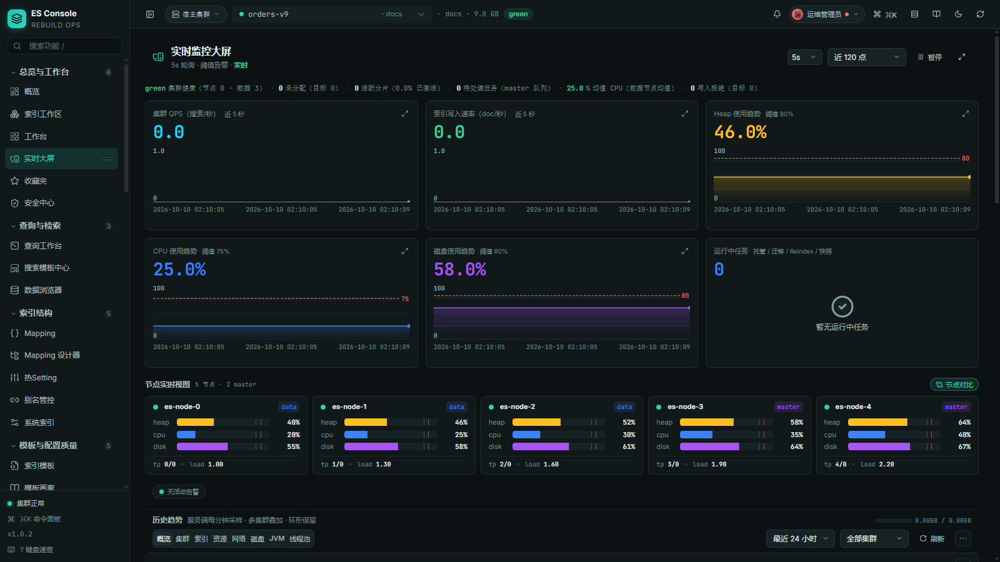
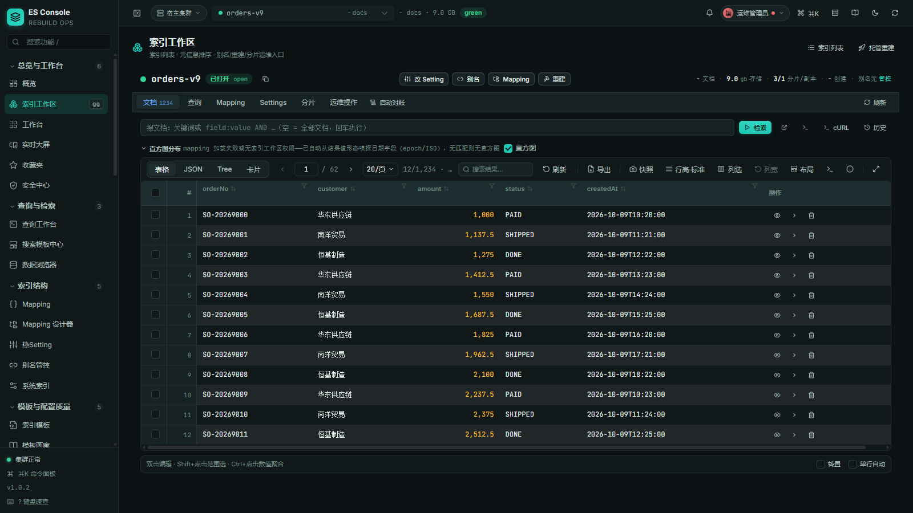
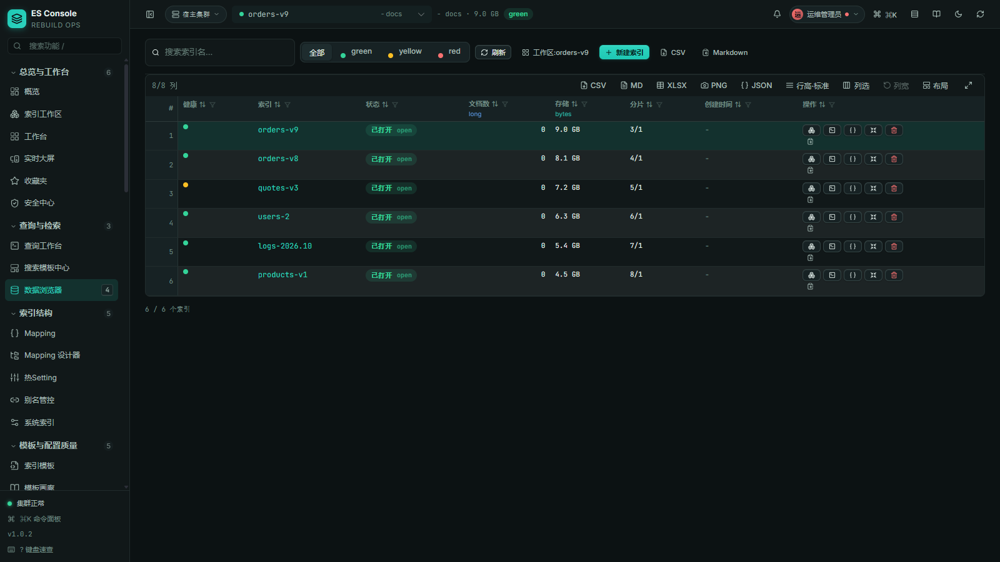
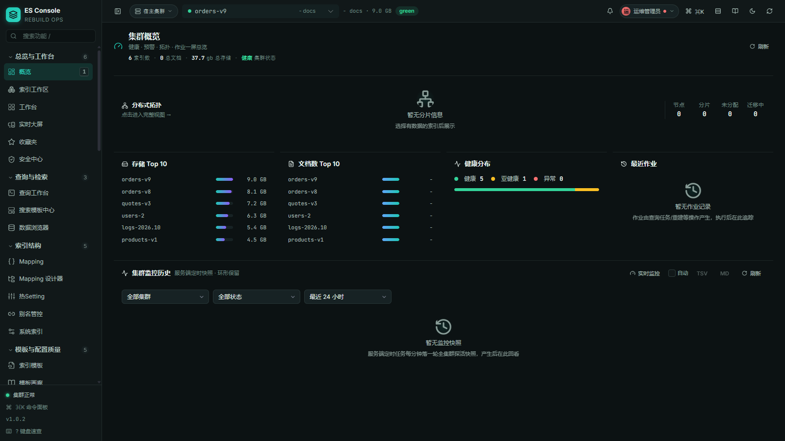

# es-rebuild-spring-boot-starter

> **Zero-downtime Elasticsearch index rebuild** for Spring Boot: alias-based write-index flip
> + server-side `_reindex`, with job tracking, delete-resurrection compensation, and a
> batteries-included ops console. Implement one interface (`ManagedEsIndex`) and you are done.

[](https://github.com/dengmeiluan/es-rebuild-spring-boot-starter/releases)
[](https://github.com/dengmeiluan/es-rebuild-spring-boot-starter/actions/workflows/ci.yml)
[](https://openjdk.java.net)
[](https://spring.io/projects/spring-boot)
[](LICENSE)

[中文 README](README.md) · [Contributing](CONTRIBUTING.md) · [Security](SECURITY.md)

## The problem it solves

Elasticsearch mappings are **immutable in place** — changing one field's type traditionally
means downtime, re-export, and traffic switching. This starter turns the whole procedure into
one dependency:

```
create new index → server-side _reindex backfill → atomic alias write-index flip
→ observation window → retire old index
```

Reads and writes never stop: writes always go through the alias (served by the write-index
flip), queries ride the alias across both indices during the transition, deletes that happen
inside the rebuild window are **compensated after backfill** (delete-resurrection), and job
state is persisted, resumable and auditable.

## Features

- **Zero-downtime rebuild** — atomic alias flip + server-side `_reindex`, dual-index
  observation window, safe old-index retirement
- **Delete-resurrection compensation** — documents deleted during the rebuild window are
  deleted again after backfill; no ghost data
- **Job tracking** — persisted state machine (JDBC store), restart-safe, auditable
- **Ops console out of the box** — 60+ page ES ops console (rebuild wizard / data browser /
  query workbench / cluster governance / audit / live monitoring) shipped inside the jar,
  zero frontend build for the host app
- **Multi-cluster** — connection catalog + SPI hosting
- **ES stack contract validation** — startup-time type-signature comparison (not version
  numbers); mismatches refuse to start with actionable remediation text
- **Compat layer** — 7.x total-hits / bulk-NDJSON shape differences handled
- **Two deployment shapes** — standalone (Kibana-style `java -jar` with the full console) or
  embedded starter (nested in a host Spring Boot app sharing its auth and routing) — same
  capabilities, two delivery modes

## Two deployment shapes

### Standalone (Kibana-style)

```bash
java -jar es-rebuild-standalone-1.0.2.jar
```

Bundles its own web server (default port `5601`) and ES client stack — no host application
required. Open `http://localhost:5601/es-rebuild.html`, complete the first-connect Setup
wizard, and the full capability set (multi-cluster management / rebuild wizard / data browser /
query workbench / live monitoring) is available. The bootstrap profile persists under
`~/.es-console/` and survives restarts. Build instructions: [standalone/README.md](standalone/README.md).

### Embedded (Spring Boot starter — the quick start below)

Add the starter as a dependency of your host Spring Boot application; console static assets
and HTTP endpoints are registered automatically, and authentication can delegate to the host
(iframe shared login) for integrated delivery.

## Quick start

### 1. Add the dependency

```xml
<dependency>
    <groupId>io.github.dengmeiluan</groupId>
    <artifactId>es-rebuild-spring-boot-starter</artifactId>
    <version>1.0.0</version>
</dependency>
```

> ### ⚠ ES stack is `provided` — bring your own
>
> The starter does **not** transitively ship the ES stack. Declare both of these in your pom:
>
> ```xml
> <dependency>
>     <groupId>org.springframework.boot</groupId>
>     <artifactId>spring-boot-starter-data-elasticsearch</artifactId>
> </dependency>
> <dependency>
>     <groupId>org.elasticsearch.client</groupId>
>     <artifactId>elasticsearch-rest-high-level-client</artifactId>
> </dependency>
> ```
>
> Why: hosts almost always carry their own ES stack. If the starter also declared one with
> `compile`, Maven's nearest-wins resolution would silently pick one version — mismatches
> explode at runtime, typically **after** the target index has been created, leaving a
> half-copy. See [docs/es-stack-contract.md](docs/es-stack-contract.md) for the full FAQ.

### 2. Declare @Document entities

The starter auto-scans `@Document` entities in your base package and safely registers new
fields to the existing ES index on startup (mapping auto-register) — zero interface
implementation, zero hand-written mapping:

```java
@Document(indexName = "bond_quote")
public class BondQuoteES {
    @Id
    private String id;

    @Field(type = FieldType.Keyword)
    private String bondCode;

    @Field(type = FieldType.Text, analyzer = "ik_max_word", searchAnalyzer = "ik_smart")
    private String shortName;
}
```

First startup with new fields logs `[MappingReconcile] status=UPDATED`; conflict semantics
are covered in [mapping-auto-register.md](docs/integration/mapping-auto-register.md).

### 3. Zero-downtime rebuild

When you need to change an existing field type, analyzer, or create a new physical index,
use the **managed rebuild** workflow:

1. Open `/internal/es/index/desired-state.html` in the business app, verify entity,
   settings, mapping and field info, then **copy the desired config**.
2. Paste it into the **Adhoc managed rebuild** wizard in the host ops console.
3. Run config validation and dry-run, confirm the plan, execute.
4. Watch the copy, catch-up, alias flip and cleanup — reads and writes never stop.

### 4. Configuration

```yaml
es:
  rebuild:
    mode: console          # rebuild-only | console
    adhoc:
      store: jdbc          # persist job state (in-memory by default)
```

All properties ship with IDE metadata (`spring-boot-configuration-processor`).

## Runnable example

[examples/demo-host](examples/demo-host/) is the runnable quick start: one `@Document` entity +
one `@SpringBootApplication` class gives you the full ops console (Setup wizard / mapping
auto-reconcile / adhoc rebuilds / live monitoring), with jobs and audit persisted to local
SQLite. Two commands to boot — see its [README](examples/demo-host/README.md).

## The ops console

With `es.rebuild.mode=console`, a full ops console ships inside the jar — zero frontend
build for the host app:

**Live monitoring** — node KPIs, cluster trends, alerts and slow requests on one screen:



**Index workspace** — index list with an embedded document grid (filter, column stats,
snapshots, export):



**Data browser** — index catalog and document-level CRUD with CSV/Markdown/XLSX export:



**Cluster overview** — health/storage/document distribution and monitoring history:



## HTTP endpoints & mapping auto-reconcile

Endpoints live under the `/internal/es/index/` path prefix, served by
`InternalEsIndexRebuildController`:

| Endpoint | Purpose |
|---|---|
| `POST /internal/es/index/rebuild` | trigger a zero-downtime rebuild |
| `GET /internal/es/index/keys` | list registered `ManagedEsIndex` keys |
| `GET /internal/es/index/desired-state.html` | desired-state page: declare the mapping you want, review, execute |

Startup mapping auto-reconcile (`MappingReconcile`, enabled via
`es.rebuild.mapping.auto-register`) adds new fields automatically; conflicts are handled per
`es.rebuild.mapping.conflict-policy` (`fail` = refuse to start, `warn` = merge conflict-free
additions only) with `USE_ADHOC_REBUILD` as the remediation pointer.
See the [integration docs](docs/integration/README.md).

## Build from source

```bash
git clone https://github.com/dengmeiluan/es-rebuild-spring-boot-starter.git
cd es-rebuild-spring-boot-starter
cd console && npm ci && npm run build && cd ..   # Node 18+
mvn clean package                                 # JDK 8+ (or ./mvnw clean package)
```

Test suites:

```bash
mvn clean test -Dconsole.build.skip=true   # backend (~990 cases; console output must exist)
cd console && npm test                     # frontend (~8200 cases)
```

## Compatibility

| Dependency | Version | Notes |
|---|---|---|
| Java | 8+ | |
| Spring Boot | 2.3.x baseline | ES stack provided; declare your own matching pair |
| Elasticsearch | 7.6+ server | `compat` layer covers 7.x shape differences |

## License

[Apache-2.0](LICENSE)
